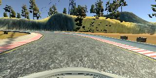

# Project 4 - Behavioral Cloning

This project from Udacity‘s Self-Driving Car Engineer Nanodegree program applies deep learning techniques on end to end learning for self-driving cars. The project covers data collection, building a suitable neural network, testing the trained model in an simulation and finally finetuning the model.

---

## 1 - Project Overview

### Goals:

* Collect suitable data with good driving behavior using the simulator 
* Build a convolutional neural network in Keras that predicts steering angles from images
* Train and validate the model with a training and validation set
* Test that the model successfully drives around track once without leaving the road
* Summarize the results with a written report

### Structure

The project is divided into different files. The simlator can be found [here](https://github.com/udacity/self-driving-car-sim).

* `model.py`: the CNN in Keras
* `drive.py`: code needed for driving the car in autonomous mode
* `model.h5`: trained CNN
* `video.mp4`: video of two successful rounds of track 1
* `README.md`: summarizing the results 

---

## 2 - Rubic Points

Here I will consider the [rubric points](https://review.udacity.com/#!/rubrics/432/view) individually and describe how I addressed each point in my implementation.  


### 2.1 - Files Submitted & Code Quality

**1.)** **Submission includes all required files and can be used to run the simulator in autonomous mode**

The structure of the project is already explained above.

**2.) Submission includes functional code**

Using the Udacity provided simulator and my drive.py and model.h5 file, the car can be driven autonomously around the track by executing 

```sh
python drive.py model.h5
```

**3.) Submission code is usable and readable**

The model.py file contains the code for training and saving the convolution neural network. The file shows the pipeline I used for training and validating the model, and it contains comments to explain how the code works. It also containes a python generator for better performance during the training process.


### 2.2 - Model Architecture and Training Strategy

**1.) An appropriate model architecture has been employed**

I implemented and adapted the convolutional neural network (CNN) as described in this [abstract](https://images.nvidia.com/content/tegra/automotive/images/2016/solutions/pdf/end-to-end-dl-using-px.pdf) by Nvidia's deep learning team. There is an detailed explanation of the architecture in section 2.3.

**2.) Attempts to reduce overfitting in the model**

Since there were no problems with overfitting, there was no need to add dropout layers to the model and save performance. The following diagram shows the mean squared error over 10 epochs (both low --> not overfitting):


The model was trained and validated on different data sets to ensure that the model was not overfitting. The model was tested by running it through the simulator and ensuring that the vehicle could stay on the track. 

**3.) Model parameter tuning**

The model used an adam optimizer, so the learning rate was not tuned manually (model.py line 93).

**4.) Appropriate training data**

 The core training data was collected in the simulator:

* 4 normal rounds
* 2 reversed rounds
* cornerings for better performance in all curves (especially the sharp right curve)
* bridge drives with recovering center driving data
* other recovering data

For each frame the center image, a flipped copy of the center image and the left and right images were used for training. For details about how I created the training data, see the next section. 


### 2.3 - Architecture and Training Documentation

**1.) Solution Design Approach**

The overall strategy for deriving a model architecture was to start with a fully connected network and then implement, adapt and test the CNN developed by Nvidia's deep learning team.

My first step was to install the simulator on my own machine and collect some data. With this data I tested the data loading pipeline and the basic framework of the training process with a simple fully-connected network. In order to gauge how well the model was working, I split my image and steering angle data into a training and validation set. The fully-connected network performed not so well in the simulator, but it helped validating, that all of the code runs without errors and with the desired behaviour (steer the car).

After that I implemented the CNN which performed way better. It had low mean squared errors on both, training and validation set. This implies that the model was not overfitting. 

Now I implemented further data augmentation (flipping the image and usage of the left and right image) and collected more data. With about 500MB of data, the implementation of a python generator was inevitable.

The final step was to run the simulator to see how well the car was driving around track one. The car had a right-hand twist and there were a few spots where the vehicle fell off the track, espacially in the right curve or in curves with water nearby. To improve the driving behavior in these cases, I collected more data (left and curve driving) and also recovering (back to center driving) data.

At the end of the process, the vehicle is able to drive autonomously around the track without leaving the road.

**2.) Final Model Architecture**

The final model architecture (model.py lines 77-92) consisted of a convolution neural network with the following layers and layer sizes:

| Layer                      | Type       | Details                                               | Activation |
| -------------------------- | ---------- | ----------------------------------------------------- | ---------- |
| Normalization              | Lambda     | Normalization by dividing by 255 and substracting 0.5 | n/A        |
| Cropping                   | Cropping2D | Cutting off top of image (containing useless data)    | n/A        |
| Convolution 1              | Conv2D     | Kernel: (5,5); Stride: (2,2); Output: 24 layers       | RELU       |
| Convolution 2              | Conv2D     | Kernel: (5,5); Stride: (2,2); Output: 36 layers       | RELU       |
| Convolution 3              | Conv2D     | Kernel: (5,5); Stride: (2,2); Output: 48 layers       | RELU       |
| Convolution 4              | Conv2D     | Kernel: (3,3); Stride: (1,1); Output: 64 layers       | RELU       |
| Convolution 5              | Conv2D     | Kernel: (3,3); Stride: (1,1); Output: 64 layers       | RELU       |
| Flatten                    | Flatten    | ---                                                   | ---        |
| Fully connected 1          | Dense      | 100                                                   | n/A        |
| Fully connected 2          | Dense      | 50                                                    | n/A        |
| Fully connected 3          | Dense      | 10                                                    | n/A        |
| Fully connected 4 (Output) | Dense      | 1                                                     | n/A        |

This network has 348 219 trainable parameters. It containes 5 convolutional layers with RELU activation to implement nonlinearity. The following diagram from the [abstract](https://images.nvidia.com/content/tegra/automotive/images/2016/solutions/pdf/end-to-end-dl-using-px.pdf) illustrates the model's architecture.


**3.) Creation of the Training Set & Training Process**

The data was taken step by step (one round/some recovering data) and the results of the trained network driving the car were analyzed after every step to debug.

To capture good driving behavior, I first recorded two laps on track using center lane driving in normal direction and reversed direction. Here is an example image of center lane driving:


Since there was a right-hand twist I collected two more laps in normal direction which has more left curves than right ones.

For better performance in curves I collected more cornerings data:



I then recorded the vehicle recovering from the left side and right sides of the road back to center so that the vehicle would learn to recover center lane driving. These images show what a recovery looks like starting from the left side:


To augment the data sat, I also flipped images and angles thinking that this would battle biased driving left or right. For example, here is an image that has then been flipped:


I also used the left and right images to help the model learn to recover from center. Here is an example of all three images (left, center, right):


After the collection process, I had 29127 images. I then preprocessed this data by a Lambda layer (division by 255.0 and substraction of 0.5) (model.py line 79) and a Cropping2D layer (model.py line 80) cutting of 70 pixels from the top and 25 pixels from the bottom.

I finally randomly shuffled the data set and put 20% of the data into a validation set using a python generator. 

I used this training data for training the model. The validation set helped determine if the model was over or under fitting. The ideal number of epochs was 10 as evidenced by decreasing mean squared error. I used an adam optimizer so that manually training the learning rate wasn't necessary.
